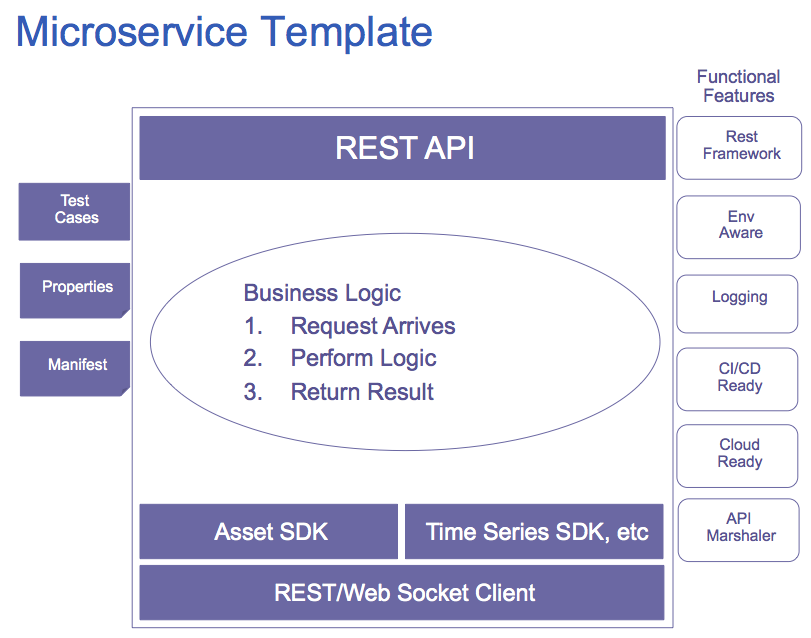

<a href="http://predixdev.github.io/predix-microservice-cf-jsr/javadocs/index.html" target="_blank" >
	
</a>
&nbsp;
<a href="http://predixdev.github.io/predix-microservice-cf-jsr" target="_blank">
	
</a>

Predix Microservice CF JSR using CXF
==============

Welcome to Predix Microservice CF JSR CXF, a Predix Backend Microservice Template.  

Each Microservice Template project shares the following characteristics
* Test cases and test case framework 
* Externalized Properties files
* REST implementation and framework
* Cloud ready with a Manifest file
* Environment Aware for Local, DEV, QA, Stage, Prod
* Continuous Integration capable

## predix-microservice-cf-jsr

This project is a cloud-ready microservice that demonstrates how to create [JSR - CXF](https://cxf.apache.org/) based Services.  You simply change the @Path url and begin adding your service implementation.  It has SpringBoot, Spring Profiles and Property file management configured and ready for local development vs. cloud deployment.  It is also set up for Test Driven Development with JUnit and Mockito.

The template has the following structure and can be used for any Predix microservice.




1. Download the project  
  ```
  $ git clone https://github.com/PredixDev/predix-microservice-cf-jsr.git  
  
  $ cd predix-microservice-cf-jsr
  
  $ mvn clean package  
  
    note: mvn clean install may run integration tests against services you may not have set up yet
  ```
1. To load in eclipse (you may skip to 'Push to Cloud' if desired)  
  
  Vanilla [Eclipse](https://www.eclipse.org/downloads) or [Eclipse STS - Springsource Tool Suite(https://spring.io/tools/sts/all) are both supported
  ```
  $ mvn eclipse:clean eclipse:eclipse  
  
  File/Import/General/Existing Projects/Browse to predix-microservice-cf dir  
  
  Check the box 'Search for nested projects'  
  ```
1. Try it out locally  
  ```
  in Eclipse - Right Click predix-microservice-cf project / Run As / Application 
  in Eclise STS - Right Click predix-microservice-cf project / Run As / Spring Boot Application 
  
  Visit service at http://localhost:9092 - a Spring RestTemplate  
  
  and http://localhost:9092/services/ping - a CXF Rest Endpoint  
  
  and http://localhost:9092/services?_wadl - a CXF Rest descriptor
  ```
1. Push to cloud  

    Take a look at the [predix-microservice-cf manifest.yml](manifest.yml) which provides properties and instructions for [pushing cloud foundry apps](https://docs.cloudfoundry.org/devguide/deploy-apps/manifest.html)
  ```
  $ cf push  
  
  visit http://(cloud-url-here)/services/ping - get the url from the output of cf push  
  ```

